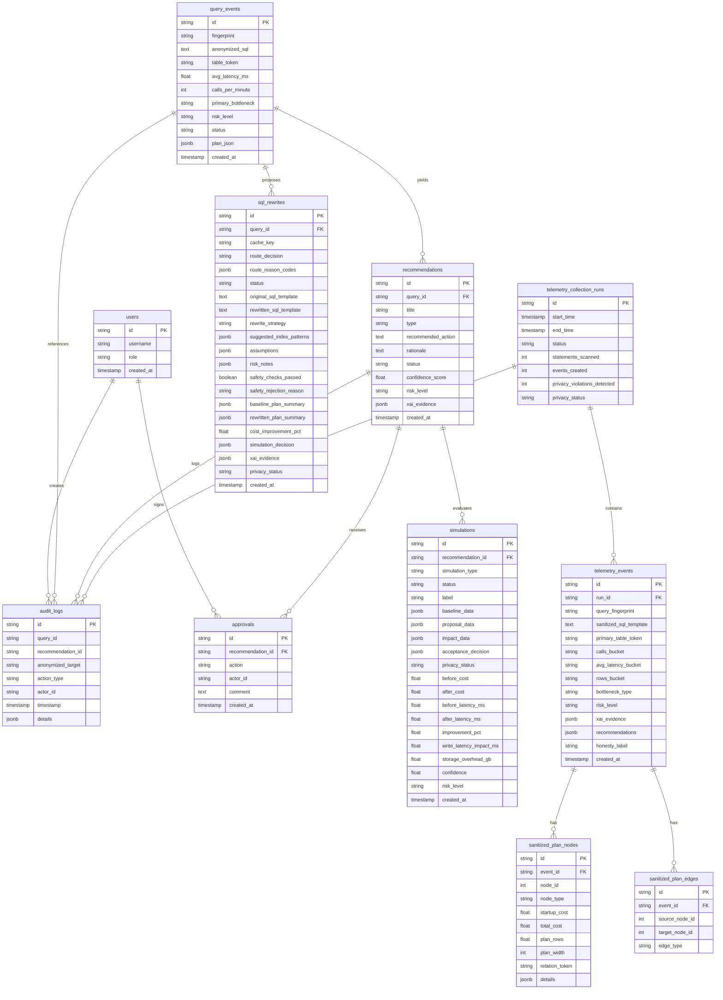

# QueryGuard AI - System Architecture

QueryGuard AI is an enterprise, privacy-first PostgreSQL performance-tuning copilot. It provides automated detection of slow query bottlenecks, generates explainable AI (XAI) evidence, simulates potential planner impact deterministically via HypoPG session-memory virtual indexes, and mandates human-in-the-loop DBA authorization prior to any production schema change.

---

## Architecture Overview

```mermaid
flowchart TD
    subgraph Frontend["Frontend Layer (Next.js 14 App Router)"]
        UI_Dash["System Health & Action Center (/)"]
        UI_Queries["Query Catalog & Detail (/queries, /queries/[id])"]
        UI_Recs["Advisory Workflow & Deep-Dive (/recommendations, /recommendations/[id])"]
        UI_Telemetry["Workload Telemetry (/telemetry, /telemetry/[id])"]
        UI_Plan["Execution Plan Visualizer (React Flow DAG)"]
        UI_Audit["Governance & Audit Logs (/audit-logs)"]
    end

    subgraph Backend["Backend Layer (FastAPI + Pydantic v2)"]
        API_Gateway["FastAPI REST Endpoints (/api)"]
        Telemetry_Collector["Telemetry Collector (Read-Only pg_stat_statements)"]
        Privacy_Engine["Privacy Engine (sqlglot Masking & HMAC-SHA256)"]
        Privacy_Scanner["Privacy Scanner Barrier (Zero-Leakage Guarantee)"]
        Plan_Analyzer["Plan Analyzer & XAI Parser (Rule-based, GNN/RL Ready)"]
        HypoPG_Service["HypoPG Simulation Service (Isolated Session Memory)"]
        Candidate_Gen["Candidate Index Generator (Equality 1st, Range 2nd)"]
        Complexity_Router["Heuristic Complexity Router"]
        SLM_Service["SQL Rewrite Service"]
        SQL_Gatekeeper["Deterministic AST Safety Gatekeeper"]
        Rehydrator["In-Memory Token Rehydrator"]
        Impact_Est["Impact & Guardrail Estimator"]
        Audit_Service["Governance & Audit Logger"]
    end

    subgraph LocalSLM["Local SLM Infrastructure (Docker Isolated)"]
        Ollama_Service["Ollama Container (port 11434)<br/>• Model: qwen2.5-coder:1.5b<br/>• Strict format: json<br/>• Zero Cloud Egress"]
    end

    subgraph WorkloadDB["Synthetic Workload Database (PostgreSQL 16)"]
        W_PG[(PostgreSQL 16 'workload-postgres:5433')]
        W_HypoPG["HypoPG Extension (In-Memory Virtual Indexes)"]
        W_Stats["pg_stat_statements Extension"]
        W_Tables["Synthetic tables: transactions, customers, products..."]
        W_User["workload_ro (Read-Only User)"]
    end

    subgraph Database["Application Database (PostgreSQL 16)"]
        PG_DB[(PostgreSQL 16 'queryguard:5432')]
        T_Users["users (DBA Actors)"]
        T_Queries["query_events (Sanitized Metadata)"]
        T_Rewrites["sql_rewrites (Masked Templates & EXPLAIN Decisions)"]
        T_TelemRuns["telemetry_collection_runs"]
        T_TelemEvents["telemetry_events (Masked)"]
        T_TelemNodes["sanitized_plan_nodes"]
        T_TelemEdges["sanitized_plan_edges"]
        T_Recs["recommendations (XAI Packets)"]
        T_Sims["simulations (HypoPG Results & Decisions)"]
        T_Approvals["approvals (DBA Authorization)"]
        T_Audit["audit_logs (Immutable Trail)"]
    end

    %% User Interaction
    DBA["DBA Engineer / Architect"] -->|Reviews & Authorizes| UI_Dash
    UI_Dash --> UI_Queries
    UI_Dash --> UI_Recs
    UI_Dash --> UI_Telemetry
    UI_Dash --> UI_Plan
    UI_Dash --> UI_Audit

    %% Frontend to Backend
    Frontend -->|REST HTTP / JSON| API_Gateway

    %% Telemetry Pipeline
    API_Gateway --> Telemetry_Collector
    Telemetry_Collector -->|Read-Only Stats & EXPLAIN| W_PG
    Telemetry_Collector --> Privacy_Engine
    Privacy_Engine --> Privacy_Scanner
    Privacy_Scanner --> Plan_Analyzer
    Plan_Analyzer --> API_Gateway

    %% HypoPG Index Simulation Pipeline
    API_Gateway --> Candidate_Gen
    Candidate_Gen --> HypoPG_Service
    HypoPG_Service -->|1. EXPLAIN Baseline<br/>2. hypopg_create_index<br/>3. EXPLAIN Proposed<br/>4. hypopg_reset| W_PG
    HypoPG_Service --> Impact_Est
    Impact_Est --> Audit_Service

    %% SLM SQL Rewrite Pipeline
    API_Gateway --> Complexity_Router
    Complexity_Router -->|Complex Queries| SLM_Service
    SLM_Service -->|Zero-Raw Masked Context| Ollama_Service
    Ollama_Service -->|Strict JSON AST Candidate| SQL_Gatekeeper
    SQL_Gatekeeper -->|Safety Passed| Rehydrator
    Rehydrator -->|EXPLAIN Baseline vs Rewrite| W_PG
    W_PG -->|≥10% Cost Gain Check| SLM_Service

    %% Persistence to App DB
    API_Gateway -->|SQLAlchemy ORM / Psycopg2| PG_DB
    PG_DB --- T_Users
    PG_DB --- T_Queries
    PG_DB --- T_Rewrites
    PG_DB --- T_TelemRuns
    PG_DB --- T_TelemEvents
    PG_DB --- T_TelemNodes
    PG_DB --- T_TelemEdges
    PG_DB --- T_Recs
    PG_DB --- T_Sims
    PG_DB --- T_Approvals
    PG_DB --- T_Audit
```

---

## Component Breakdown

### 1. Privacy-First Ingestion & Sanitization Engine
- **Literal Masking**: Scalar values (e.g., numbers, strings, timestamps, UUIDs) are converted to deterministic placeholders (`:INT`, `:NUM`, `:STR`, `:DATE`, `:UUID`).
- **Identifier Tokenization**: Customer tables and schema columns are remapped into synthetic tokens (`transactions` $\to$ `TBL_A12`, `region_id` $\to$ `COL_R01`).
- **Multi-Stage Privacy Barrier**: Before database persistence or response delivery, the backend scanner ensures zero unmasked integers, timestamps, string literals, or plaintext relation/attribute names escape.

### 2. Rule-Based Plan Analyzer & Explainable AI (XAI)
- Parses PostgreSQL JSON execution plans (`EXPLAIN (FORMAT JSON)`).
- Detects core query bottlenecks:
  - **Sequential Scan on High-Volume Tables**: Traversal across $>100\text{k}$ rows without index coverage.
  - **Repeated Nested Loop Joins**: Outer loop row amplification with unindexed inner join keys.
  - **Expensive Sorts / External Merge**: High sort cost resulting in memory spill or latency spikes.
- Constructs structured **XAI Evidence Packets** detailing bottleneck nodes, observed signals, expected read gain, estimated write impact, and storage overhead.

### 3. HypoPG Hypothetical-Index Simulation Engine
- **100% In-Memory Sandbox**: Utilizes the PostgreSQL `hypopg` extension in a dedicated session against `workload-postgres`.
- **Zero Physical Disk Footprint**: Virtual indexes exist purely within session RAM; no physical B-tree pages are allocated, and no table locks are held.
- **Candidate Index Rules**:
  1. Equality filter columns first (`WHERE col = val`).
  2. Range / sort columns second (`WHERE col > val`, `ORDER BY col`).
  3. Rejects expression, partial, and unique indexes for safety in MVP.
- **Immediate Cleanup**: Every simulation session executes `SELECT * FROM hypopg_reset()` in a `finally` block to prevent index leakage.
- **Acceptance Decision Guardrails**: Recommends optimizations only if planner cost reduction exceeds $40\%$ and the virtual index is actively selected by the PostgreSQL planner.

### 4. Human-In-The-Loop DBA Approval Workflow
- Every optimization is staged in `PENDING` or `SIMULATED` state.
- Authorizing or rejecting a change requires explicit DBA confirmation with mandatory rationale comments.
- Records an immutable audit log entry capturing the actor ID, tokenized target, and verification timestamp.
- **Zero Automated DDL**: QueryGuard never executes physical DDL on disk. Recommended SQL is copied and applied by authorized DBAs according to company deployment procedures.

### 5. Local Small Language Model (SLM) SQL Rewrite Pipeline & Safety Gateway
- **Heuristic Complexity Routing**: Queries with $\le 2$ joins and plan depth $\le 5$ follow the fast deterministic path (`NOT_ROUTED_SIMPLE_QUERY`). High-complexity queries trigger the local SLM.
- **Zero-Data Context Prompting**: Only anonymized tokens (`TBL_A12`, `COL_R01`), operator features, and selectivity buckets are injected into the prompt.
- **Local Ollama Sandbox**: Runs entirely on local infrastructure with zero cloud API dependencies. Model outputs are constrained to strict JSON (`SLMRewriteOutput`).
- **AST Safety Gatekeeper**: Validates that candidates are single `SELECT` statements, containing zero comments, no multi-statement injection, no system functions, and using only whitelisted tokens.
- **PostgreSQL Sandbox EXPLAIN Guardrail**: Candidates are evaluated against the original baseline on `workload-postgres`. Rewrites are accepted only if total cost improves by $\ge 10\%$.

### 6. Experimental Plan Graph Neural Network (GNN) Bottleneck Classifier
- **Graph Topology Formulation**: Transforms execution plan operator trees into directed acyclic graphs with bidirectional message-passing edges ($2 \times E$).
- **24-Dimensional Privacy-Safe Node Vectors**: Includes one-hot operator type (12 dims), normalized log total cost, log rows, startup cost fraction, plan depth, child count, structural predicate flags (filter, join cond, sort key, group key), execution loops, and relation size buckets. Contains strictly zero raw SQL or schema names.
- **Pure PyTorch GraphSAGE Architecture**: Implemented via vectorized standard PyTorch operations (`index_add_`), eliminating external compiled C++ binary dependencies (`torch-geometric` ABI). Runs inference in &lt;5ms on standard CPU.
- **7 Canonical Bottleneck Classes**:
  1. `SEQ_SCAN_BOTTLENECK`
  2. `NESTED_LOOP_BOTTLENECK`
  3. `EXPENSIVE_SORT`
  4. `HASH_JOIN_HEAVY`
  5. `AGGREGATION_HEAVY`
  6. `GOOD_OR_OPTIMIZED_PLAN`
  7. `CARDINALITY_ESTIMATION_RISK`
- **Offline Benchmark Performance**: 100.0% holdout accuracy and 1.000 Macro F1 evaluated across 140 synthetic plan graphs generated from `workload-postgres`.
- **Hybrid Safety Architecture**: The GNN acts strictly as an advisory evidence signal. The deterministic rule engine remains the authoritative source for all recommendations. Any prediction with confidence &lt; 0.65 is gated, and divergence between the GNN and the rule engine is explicitly surfaced in the UI without overriding rule-based recommendations.

---

## Data Model ERD

