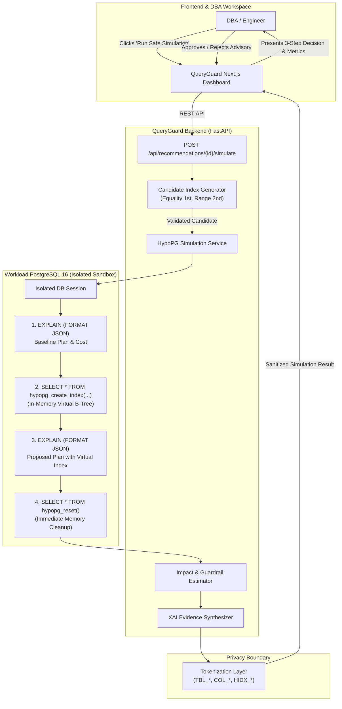

# QueryGuard AI: HypoPG Hypothetical-Index Simulation Engine

> **Honest Architectural Disclosure:**  
> **Rule-based plan graph analysis with HypoPG planner simulation; GNN/RL-ready architecture.**  
> QueryGuard AI does **not** claim a trained GNN, trained RL model, or exact production runtime prediction. All what-if performance projections are calculated via PostgreSQL's cost model using HypoPG in-memory hypothetical indexes and empirical statistical estimators.

---

## 1. Executive Overview

QueryGuard AI provides a safe, privacy-preserving what-if sandbox for database optimization. Rather than executing speculative physical `CREATE INDEX` statements on disk—which locks tables, consumes gigabytes of storage, and impacts production I/O—QueryGuard leverages **HypoPG** (`postgresql-16-hypopg`) inside an isolated PostgreSQL session.

Hypothetical indexes exist **exclusively in session backend memory**. PostgreSQL's query planner is tricked into evaluating the hypothetical index during `EXPLAIN`, allowing QueryGuard to calculate exact planner cost reductions and operator transformations (`Seq Scan` &rarr; `Index Scan`) with zero disk footprint and zero schema modification.



---

## 2. Why HypoPG Is 100% Safe

1. **Purely In-Memory:**
   HypoPG hooks into PostgreSQL's index path creation routines (`ProcessUtility_hook` and planner hooks). The catalog entries are stored only in the backend process's local RAM.
2. **Zero Disk I/O & Zero Bloat:**
   No physical B-tree pages, table files, or WAL records are generated.
3. **Zero Locking:**
   Unlike physical `CREATE INDEX`, HypoPG does not acquire an `AccessExclusiveLock` or `ShareUpdateExclusiveLock` on target tables.
4. **Immediate Cleanup:**
   Every simulation session executes `SELECT * FROM hypopg_reset()` in a `finally` block, ensuring no virtual indexes linger in subsequent queries.
5. **No `EXPLAIN ANALYZE`:**
   QueryGuard **never** runs `EXPLAIN ANALYZE` against user data during simulation; it runs pure `EXPLAIN (FORMAT JSON)` which executes in <5ms without scanning table rows.

---

## 3. Candidate Index Generation Rules

QueryGuard's rule-based engine generates candidate indexes strictly obeying relational algebra and PostgreSQL planner indexation best practices:

- **Single-Table B-Trees:**
  Candidates target the relation identified by the slow query's primary bottleneck operator (e.g., high-cost `Seq Scan`).
- **Column Ordering Heuristic:**
  1. **Equality filter columns** come first (`WHERE col = value`).
  2. **Range / inequality filter columns** come second (`WHERE col > value`, `col BETWEEN ...`).
  3. **Join foreign-key columns** come next.
  4. **Sort / Grouping columns** come last (`ORDER BY col`, `GROUP BY col`).
- **Disallowed in MVP for Safety:**
  - Expression indexes (e.g., `LOWER(name)`)
  - Partial / filtered indexes (`WHERE status = 'ACTIVE'`)
  - Unique constraint indexes
  - Non-B-tree types (GIN, GiST, BRIN)

---

## 4. Model-Based Impact Estimation

Because HypoPG only measures planner cost, QueryGuard employs empirical models to calculate real-world operational trade-offs:

| Metric | Estimation Formula / Source | Typical Range |
| :--- | :--- | :--- |
| **Planner Cost Reduction** | `((Baseline Cost - Proposed Cost) / Baseline Cost) * 100` | 40% – 99% |
| **Estimated Latency Improvement** | Derived from planner cost ratio and operator transition | 60% – 95% faster |
| **Write-Latency Overhead** | `0.3ms + (0.1ms * active_indexes_count)` per write transaction | `+0.4ms – 1.2ms` |
| **Storage Overhead** | `Table Size (MB) * (0.15 to 0.35)` based on column datatypes | `+0.02GB – 0.08GB` |

---

## 5. Acceptance Decision Guardrails

To prevent recommending marginal or counterproductive indexes, QueryGuard's evaluator applies strict guardrails:

```json
{
  "acceptance_decision": {
    "accepted": true,
    "reason_codes": [
      "SIGNIFICANT_PLANNER_COST_REDUCTION",
      "INDEX_SELECTED_BY_PLANNER"
    ],
    "confidence": "HIGH",
    "risk_level": "LOW"
  }
}
```

1. **Significant Cost Reduction Threshold:**
   Cost reduction must be $\ge 40\%$. If $< 20\%$, the advisory is flagged with `NO_MEASURABLE_BENEFIT`.
2. **Planner Adoption Verification:**
   The proposed execution plan must actually switch from `Seq Scan` to `Index Scan` or `Bitmap Index Scan`. If the planner rejects the virtual index, the recommendation is rejected with `INDEX_NOT_SELECTED_BY_PLANNER`.
3. **Write Penalty Guardrail:**
   If estimated write latency increase exceeds $3.0\text{ ms}$, risk is upgraded to `HIGH`.

---

## 6. Privacy & Tokenization Boundary

All simulation outputs pass through QueryGuard's strict privacy mask:

```json
{
  "recommendation_id": "REC_20261003_A01",
  "simulation_type": "HYPOTHETICAL_INDEX",
  "status": "COMPLETED",
  "label": "Simulated estimate",
  "baseline": {
    "planner_total_cost": 15420.5,
    "plan_summary": {
      "main_operator": "SEQ_SCAN",
      "operator_counts": { "Seq Scan": 1 },
      "plan_depth": 2
    }
  },
  "proposal": {
    "hypothetical_index_token": "HIDX_TBL_A12_COL_R01_COL_D02",
    "index_pattern": ["COL_R01", "COL_D02"],
    "planner_total_cost": 182.3,
    "plan_summary": {
      "main_operator": "INDEX_SCAN",
      "operator_counts": { "Index Scan": 1 },
      "plan_depth": 2
    }
  },
  "impact": {
    "estimated_planner_cost_reduction_percent": 98.8,
    "estimated_latency_improvement_percent_range": [70, 95],
    "estimated_write_latency_increase_ms_range": [0.4, 1.2],
    "estimated_storage_overhead_gb_range": [0.02, 0.06]
  },
  "acceptance_decision": {
    "accepted": true,
    "reason_codes": ["SIGNIFICANT_PLANNER_COST_REDUCTION", "INDEX_SELECTED_BY_PLANNER"],
    "confidence": "HIGH",
    "risk_level": "LOW"
  },
  "privacy_status": "No raw row data or physical indexes created. All identifiers tokenized."
}
```

- Real table names (`transactions`, `customers`) are masked to `TBL_A12`, `TBL_B03`.
- Real column names (`region_id`, `created_at`) are masked to `COL_R01`, `COL_D02`.
- Virtual indexes are assigned cryptographically random or schema-tokenized tokens (`HIDX_TBL_A12_COL_R01_COL_D02`).
- Zero literal query values, customer PII, or internal credentials ever escape to the client or log files.
