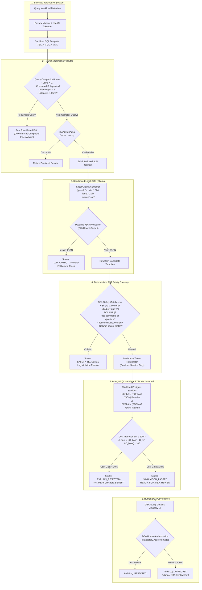

# QueryGuard AI - Local Small Language Model (SLM) SQL Rewrite Pipeline

QueryGuard AI incorporates a privacy-preserving, local Small Language Model (SLM) copilot designed exclusively for complex query template refactoring. Operating entirely within local infrastructure via Ollama, this subsystem never communicates with external cloud LLMs, ensuring zero leakage of metadata, query literals, schema definitions, or customer data.

Every candidate rewrite generated by the SLM must pass strict deterministic AST safety gatekeeping, token rehydration validation, and PostgreSQL planner cost comparison (`EXPLAIN (FORMAT JSON)`) before it can be presented to a human Database Administrator (DBA).

---

## Architecture & End-to-End Verification Flow



---

## 1. Heuristic Complexity Router

To minimize local inference latency and eliminate hallucination risk on standard queries, QueryGuard routes queries using deterministic AST and execution-plan heuristics:

| Condition Metric | Threshold | Rationale |
| :--- | :--- | :--- |
| **Join Count** | `> 2` tables | Multi-table joins frequently suffer from suboptimal join order selection or cartesian expansion. |
| **Nested / Correlated Subqueries** | Present (`EXISTS`, `IN`, Scalar Subquery) | Often optimizable via CTEs, window functions, or explicit `JOIN` unnesting. |
| **Execution Plan Depth** | `> 5` tree levels | Deep planner trees indicate complex nested operator pipelines. |
| **Observed Mean Latency** | `> 100 ms` | Fast queries do not warrant LLM analysis overhead. |
| **Primary Bottleneck** | `HIGH_CARTESIAN_PRODUCT` or `EXPENSIVE_SORT_SPILL` | Workloads benefiting from pre-aggregation CTEs or early filtering. |

Queries failing these complexity triggers follow the **Simple Query Fast Path**, receiving immediate deterministic index recommendations with status `NOT_ROUTED_SIMPLE_QUERY`.

---

## 2. Sanitized Context Injection (Zero-Data Leakage)

The prompt supplied to the local SLM contains **strictly zero raw data, literals, or database schema identifiers**:

1. **Relation Anonymization**: All tables are tokenized as `TBL_[A-Z0-9]{3}` (e.g. `TBL_A12`).
2. **Column Anonymization**: All columns are tokenized as `COL_[A-Z0-9]{3}` (e.g. `COL_R01`).
3. **Literal Stripping**: Scalar constants are replaced with type placeholders (`:INT`, `:STR`, `:DATE`).
4. **Context Injection**:
   - Estimated row count buckets (`SMALL: <1k`, `MEDIUM: 1k-100k`, `LARGE: >100k`)
   - Operator bottleneck indicators (`Nested Loop on TBL_B03`, `Sort on COL_D02`)
   - Authorized token whitelist (the model is strictly forbidden from introducing new identifiers)

Prompt generation is guarded by automated assertions that verify zero plaintext table names (`transactions`, `customers`, etc.) or raw literals exist in the system prompt or user message payload.

---

## 3. Strict JSON Schema Contract (`SLMRewriteOutput`)

The local model must return a single, valid JSON object matching the following Pydantic schema:

```json
{
  "$schema": "http://json-schema.org/draft-07/schema#",
  "title": "SLMRewriteOutput",
  "type": "object",
  "required": [
    "rewritten_query_template",
    "rewrite_strategy",
    "suggested_index_patterns",
    "assumptions",
    "risk_notes"
  ],
  "properties": {
    "rewritten_query_template": {
      "type": "string",
      "description": "Valid PostgreSQL SELECT statement using only authorized masked tokens"
    },
    "rewrite_strategy": {
      "type": "string",
      "description": "Short categorization (e.g. CTE_PRE_AGGREGATION, CORRELATED_SUBQUERY_FLATTENING)"
    },
    "suggested_index_patterns": {
      "type": "array",
      "items": {
        "type": "object",
        "required": ["table_token", "columns", "reason"],
        "properties": {
          "table_token": { "type": "string" },
          "columns": { "type": "array", "items": { "type": "string" } },
          "reason": { "type": "string" }
        }
      }
    },
    "assumptions": {
      "type": "array",
      "items": { "type": "string" }
    },
    "risk_notes": {
      "type": "array",
      "items": { "type": "string" }
    }
  }
}
```

If the model response violates JSON syntax or the schema contract, the pipeline rejects the output with status `LLM_OUTPUT_INVALID` and safely falls back to rule-based index advisory.

---

## 4. AST Safety Gatekeeper Rules

Before any candidate SQL is considered for planner simulation, the `SQLGatekeeper` parses the abstract syntax tree (AST) via `sqlglot`:

1. **SELECT-Only Enforcement**: Rejects any statement containing `INSERT`, `UPDATE`, `DELETE`, `DROP`, `ALTER`, `CREATE`, `TRUNCATE`, `GRANT`, `REVOKE`, `COPY`, `VACUUM`, `EXECUTE`, or `SET`.
2. **Single-Statement Rule**: Rejects semicolons (`;`) or multiple AST root expressions.
3. **Zero Comment Toleration**: Rejects SQL containing inline (`--`) or block (`/* ... */`) comments to prevent prompt injection or SQL injection evasion.
4. **Token Whitelist Verification**: Verifies that every identifier in the rewrite belongs strictly to the authorized token set of the original query.
5. **Forbidden Function Blacklist**: Prohibits dangerous built-ins such as `pg_sleep`, `pg_read_file`, `dblink`, `version`, and system catalog introspection.
6. **Structural Guardrails**: Limits maximum join count ($\le 6$) and maximum subquery nesting depth ($\le 4$).
7. **Semantic Relational Consistency**: Verifies that output column counts match the baseline query and relations referenced are a valid subset of the target workload.

---

## 5. PostgreSQL Sandbox EXPLAIN Guardrail

Candidate rewrites that pass AST safety undergo sandbox planner comparison:

1. **Local In-Memory Rehydration**: Inside the backend worker process only, masked tokens (`TBL_A12`) are mapped back to their synthetic sandbox table names (`transactions`) for the active database session.
2. **Planner Comparison**: Both original and rewritten queries are analyzed using `EXPLAIN (FORMAT JSON)` on `workload-postgres`.
3. **Threshold Check**:
   $$\Delta \text{Cost} = \left(\frac{\text{Baseline Cost} - \text{Rewritten Cost}}{\text{Baseline Cost}}\right) \times 100$$
   - If $\Delta \text{Cost} \ge 10.0\%$, the candidate is accepted with status `SIMULATION_PASSED` / `READY_FOR_DBA_REVIEW`.
   - If $\Delta \text{Cost} < 10.0\%$, the candidate is rejected with status `EXPLAIN_REJECTED` or `NO_MEASURABLE_BENEFIT`.

---

## 6. Local Ollama Infrastructure & Model Setup

The system includes an `ollama` service in `docker-compose.yml`:

```yaml
  ollama:
    image: ollama/ollama:latest
    container_name: queryguard-ollama
    ports:
      - "127.0.0.1:11434:11434"
    volumes:
      - ollama_data:/root/.ollama
    environment:
      - OLLAMA_KEEP_ALIVE=24h
    restart: unless-stopped
```

### Pulling the Recommended Model

For CPU-friendly lightweight execution with high coding fidelity, QueryGuard defaults to `qwen2.5-coder:1.5b`:

```bash
# Via helper script (Linux/macOS)
./scripts/pull_model.sh qwen2.5-coder:1.5b

# Via PowerShell (Windows)
.\scripts\pull_model.ps1 -Model "qwen2.5-coder:1.5b"

# Or directly using docker exec
docker compose exec ollama ollama pull qwen2.5-coder:1.5b
```

Recommended alternative local models:
- `llama3.2:3b` (Higher reasoning capacity, ~2.5 GB RAM)
- `qwen2.5-coder:7b` (Production workstation / GPU grade, ~5.5 GB RAM)

---

## 7. Known Limitations & Human-in-the-Loop Boundaries

1. **Read-Only / Non-Executing**: QueryGuard never executes `EXPLAIN ANALYZE` on unvetted rewrites to prevent uncontrolled server resource consumption. It relies purely on cost model estimation (`EXPLAIN (FORMAT JSON)`).
2. **Zero Automated Deployment**: Suggested SQL templates are purely advisory. A human DBA must inspect the diff and apply changes to application code or repositories.
3. **Dialect Boundary**: The SLM is prompted specifically for PostgreSQL 16 planner idioms (such as CTE materialization controls `WITH ... AS NOT MATERIALIZED`).
